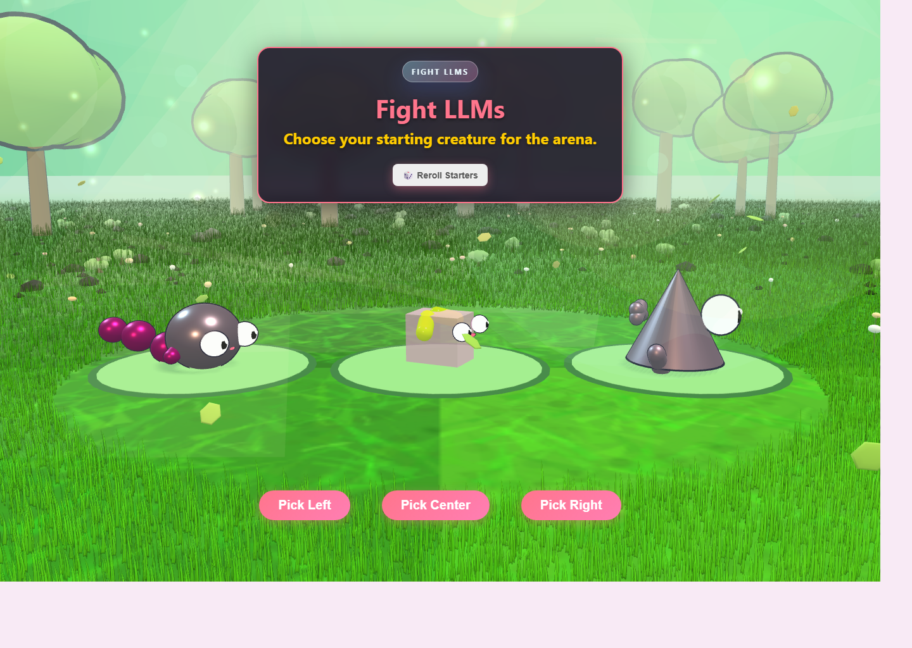

# Slay the Spore

> A playful creature-evolution card battler built as a stylish browser prototype with handcrafted Three.js scenes, mutation-driven progression, and an experimental local LLM rival mode.

## What This Repo Is

**Slay the Spore** is a web game prototype where you:

- pick a starting creature,
- fight turn-based battles with a growing card deck,
- evolve after each victory,
- unlock body mutations at milestone stages,
- and, in a special mode, battle a locally running rival AI personality.

The project mixes **deckbuilder combat**, **creature evolution**, and **real-time 3D presentation** into a single static HTML/JavaScript repo that you can open and explore directly in the browser.

## Core Game Loop

1. Start with one of three random starter creatures.
2. Enter combat with a simple starter deck of attacks and blocks.
3. Win battles to choose a new reward card or skip and still evolve.
4. Reach evolution milestones and pick permanent body mutations.
5. Keep scaling your creature into weirder, stronger, more specialized forms.

The result is a prototype that feels part roguelike deckbuilder, part creature lab, and part visual sandbox.

## Features

### Deckbuilding Combat

- Turn-based combat with **energy, draw/discard piles, block, damage, and enemy intent**.
- A growing card pool with offensive, defensive, healing, and combo-oriented effects.
- Combat statuses and synergies such as:
  - Strength scaling
  - healing-to-damage conversion
  - start-of-turn healing
  - extra energy gain
  - attack repeats
  - dodge chance
  - enemy skip chance

### Evolution and Mutation System

- Your creature evolves after each victory.
- Every few evolutions, you unlock a **major mutation choice**.
- Mutations are grouped into milestone tiers:
  - **Tier 1:** Legs, Wings, Tentacles
  - **Tier 2:** Sonar, Teeth, Claws
  - **Tier 3:** Hands, Paws, Fangs
- Each mutation changes combat stats or behavior, including things like:
  - more max HP,
  - dodge bonuses,
  - extra draw,
  - attack bonuses with tradeoffs,
  - counter-attacks,
  - turn-start strength growth,
  - and skip-turn pressure on enemies.

### Local LLM Rival Mode

- `index.html?mode=llm` enables **Fight LLMs**, a special battle mode.
- Enemies roll from a pool of personalities like **Friendly**, **Pest**, **Mathematician**, and **Knowitall**.
- The rival mind can **taunt, chat, and telegraph intent** through a dedicated battle-side UI.
- The implementation uses **WebLLM** and a small worker wrapper so the experience stays **local in the browser**.
- The mode checks for **WebGPU** support and is designed for recent Chromium-based browsers.

### 3D Presentation and Look-Dev

- The main game uses **Three.js** for the creature presentation and battle-stage visuals.
- The repo also includes separate visual playgrounds and look-dev pages:
  - [`main_screen.html`](./main_screen.html) for the project menu
  - [`evolution_lab.html`](./evolution_lab.html) for mutation sandbox testing
  - [`dragon_scene.html`](./dragon_scene.html) for procedural dragon look-dev
  - [`vegetation_preview.html`](./vegetation_preview.html) for environment and foliage exploration

These extra pages make the repo feel like both a game prototype and a creative R&D space for art direction, creature generation, and environmental style.

## Tech We Worked With

This repo is intentionally lightweight, but it still packs in a lot of interesting ideas:

- **Vanilla HTML, CSS, and JavaScript**
- **Three.js** for 3D rendering, cameras, lighting, and scene construction
- **OrbitControls** for scene inspection in the lab and preview pages
- **WebGL/WebGPU browser capabilities**
- **WebLLM** for local in-browser model inference in the AI battle mode
- **Web Workers** for the LLM engine bridge
- **Procedural / code-driven content**, including:
  - creature generation,
  - mutation-based stat shaping,
  - stylized environment work,
  - and self-contained geometry-based scene experiments

## Repo Structure

| File | Purpose |
| --- | --- |
| `index.html` | Main playable prototype |
| `cards.js` | Shared card definitions and combat effect logic |
| `fight_llms_worker.js` | Worker bridge for WebLLM |
| `main_screen.html` | Main menu / launcher page |
| `evolution_lab.html` | Mutation sandbox and visualization lab |
| `dragon_scene.html` | Stylized dragon look-dev scene |
| `vegetation_preview.html` | Forest and battle-environment look-dev |
| `Cards/`, `Icons/`, `Textures/` | Art assets used by the prototype |

## Running It

There is no heavy setup here. This is a browser-first prototype.

### Quick Start

- Open [`main_screen.html`](./main_screen.html) to browse the available modes.
- Open [`index.html`](./index.html) to jump straight into the main game.
- Open [`index.html?mode=llm`](./index.html?mode=llm) to try the local AI battle mode.

### Recommended

Because the project uses module imports from CDNs and browser-side graphics features, it works best in a **recent Chrome or Edge build**.  
For the smoothest local testing experience, serving the folder through a simple local web server is safer than relying on every browser's local `file://` behavior.

## Why This Project Is Interesting

This repo is more than a small card game prototype. It is a compact experiment in combining:

- roguelike deckbuilder design,
- procedural creature identity,
- mutation-based progression,
- expressive UI styling,
- browser-native 3D,
- and local AI-driven enemy flavor.

It is the kind of project that shows both **game design thinking** and **creative technical experimentation** in the same place.

## License

This project is released under the terms of the [MIT License](./LICENSE).
